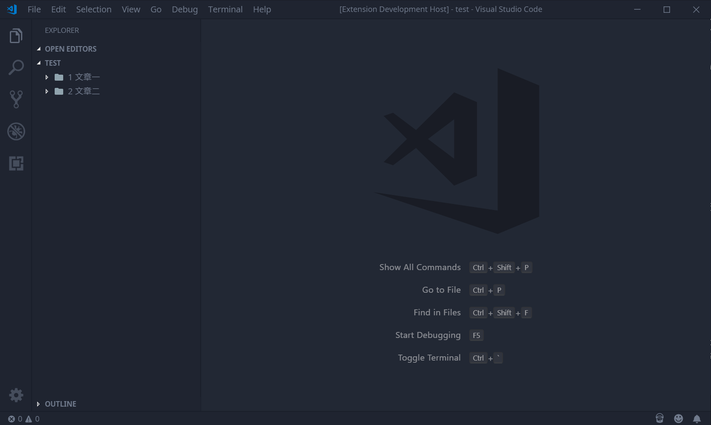
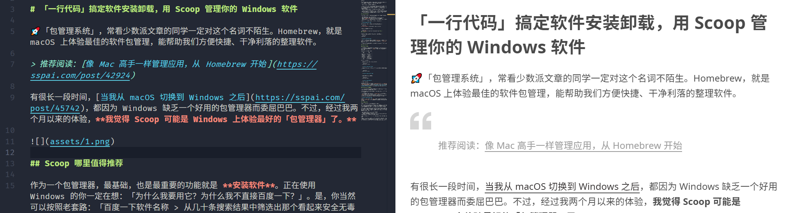
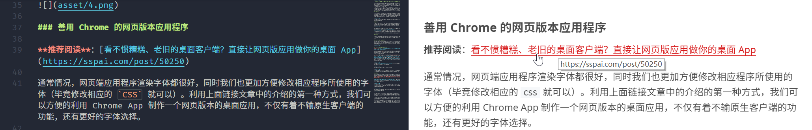

<div align="middle">


<h1>少数派 Matrix 文章撰写助手</h1>

<strong><p>VS Code Markdown Helper for <em>sspai.com</em></p></strong>

</div>

##### 注：本插件与少数派官方无关，由个人开发者（我）凭兴趣开发。

## 功能 Features

请注意，**Matrix 文章撰写助手**：

- 不可以帮助你将文章上传到少数派 Matrix 栏目
- 也不能帮助你直接发布文章到少数派首页

发布文章请将渲染好的富文本复制并粘贴到少数派编辑器中，并自行对格式、图片进行修正。

**Matrix 文章撰写助手** 可以：

- 生成文章和本地图片库的骨架
- 提供和少数派网站文章格式几乎相同的预览

具体地：

### 生成文章库骨架



方法：`Ctrl + Shift + P` → 输入「sspai」，选择「New sspai post」，并在接下来的页面中依次输入「文章文件夹名称」、「文章文件名」、「文章标题」。（文章文件名不需要带后缀）

比如，**Matrix 文章撰写助手** 可以生成以下结构的文章文件夹：

```bash
.
├── image
│   └── banner.png
└── post.md

1 directory, 2 files
```

其中，`post.md` 是文章主体，`image/` 为文章图片库。（助手并不会生成 `banner.png`，仅作示范用。）

### Markdown 预览样式

在利用 VS Code 写作时，**Matrix 文章撰写助手** 可以将 Markdown 预览格式替换为少数派网页文章的样式，方便预览和调整。比如：

#### 引用



#### 链接



等等。

## 推荐配置 Recommendations

1. 推荐仅在你本机的少数派文档库下启用本插件，以免将全部 Markdown 预览格式替换为少数派格式。**即在全局禁用（Disable）本插件，仅在文档库下启用（Enable）。**

2. 推荐少数派文档库目录下的文件格式：

```bash
.
├── 1 文章一
│   ├── image/
│   └── Post1.md
├── 2 文章二
│   ├── image/
│   └── Post2.md
└── 3 文章三
    ├── image/
    └── Post3.md
...
```

## 免责 Disclaimer

**Matrix 文章撰写助手** 和少数派官方无关，只作为在本地撰写文章的一个辅助，因此未来也不会考虑开发直接发布到少数派的功能。

---

📌 **VS Code Markdown Helper for sspai** ©Spencer Woo. Released under the [MIT](https://github.com/spencerwooo/vscode-sspai-markdown-helper/blob/master/LICENSE) License.

Authored and maintained by Spencer Woo.

[@Blog](https://spencerwoo.com/) · [ⒿJike](https://web.okjike.com/user/4DDA0425-FB41-4188-89E4-952CA15E3C5E) · [@GitHub](https://github.com/spencerwooo)
